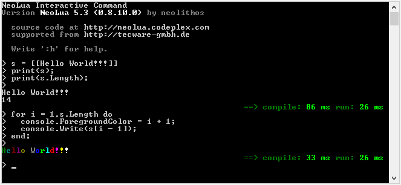

NeoLua
======

A Lua implementation for the Dynamic Language Runtime (DLR).

# Introduction

NeoLua is an implementation of the Lua language. Currently, the implementation is on 
the level of [Lua 5.2](http://www.lua.org/) (http://www.lua.org/manual/5.2/manual.html). 
The goal is to follow the reference of the C-Lua implementation and combine this with full 
.NET Framework support. That means, it should be easy to call .NET functions from Lua and it should 
be easy access variables and functions from a .net language (e.g. C#, VB.NET, ...).

NeoLua is implemented in C# and uses the [Dynamic Language Runtime](https://dlr.codeplex.com/). It therefore 
integrates very well with the .net framework.

## What NeoLua is useful for

* Outsource the logic of your application into scripts
* Structuring of logic
* Build a dynamic configuration system, with functions and variables
* As a formula parser
* ...

So, this could be reliable partner for your compiled .NET application or engine (e.g. Game Engines).

## What I did not have in mind

* Compiling libraries
* Standalone applications

## Advantages of NeoLua

* Dynamic access between Lua script and and the host application/.NET framework and vice-versa.
* NeoLua is based on the DLR. So you get compiled code that is collectable and well-optimized.
* It is compatible with the .NET world (e.g. C#, VB.NET, IronPython, ...).
* Full and easy access to the .NET framework or your own libraries (with no stub code).
* A rich implementation of the lua table, for a got integration in the .net world e.g. Binding, Enumeration, ...
* A .NET Framework Garbage Collector that is well-tested and very fast.
* Pure IL (x86,x64 support)

## Drawbacks of NeoLua

* It is not [100% compatible](http://todo) to Lua. But I will try very hard.
* No deploy of precompiled scripts.

## Drawbacks of bridges to c-lua, that are solved with NeoLua

* You have two memory managers and so you have to marshal every data between these two worlds. That takes time and there are a lot pitfalls to get memory leaks.
* C-Lua interprets its own bytecode. The code is not compiled to machine code.

# Documentation

todo

# Links

Article on CodeProject: http://www.codeproject.com/Articles/674128/NeoLua-Lua-for-the-net-dynamic-lanuguage-runtime

Nuget package: https://www.nuget.org/packages/NeoLua/
